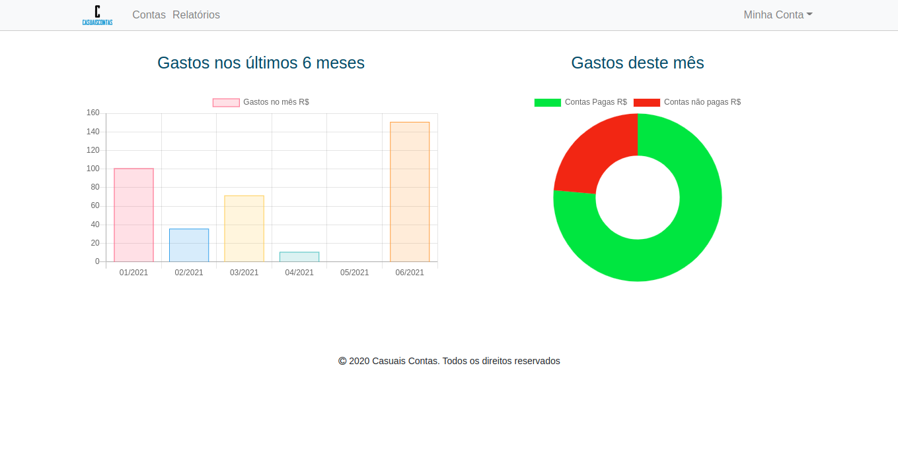

***
## :bulb: Sobre o projeto

- Projeto criado para colcoar em prática conceitos adquiridos em cursos de Java e Spring.
- O projeto consiste em uma aplicação para gerenciar contas de uma pessoa física. Além de todo o CRUD básico de usuário e contas/despesas, é possível acompanhar as despesas por meio de gráficos ou por meio de um relatório que é gerado pela aplicação.
- A aplicação também conta com o envio de e-mail para confirmação de cadastro e para redefinição de senha

***

## :computer: Tecnologias utilizadas

- Spring Security
- Spring Data JPA
- Spring MVC
- Thymeleaf
- MySQL
- JasperReports
- Ehcache

***

## :mag: Alguns exemplos de telas

- _Tela de Login_

- _Home_

- _Tela de opções de relatório_

- _Tela para pesquisar contas/despesas_

- _Exemplo de relatório gerado_

